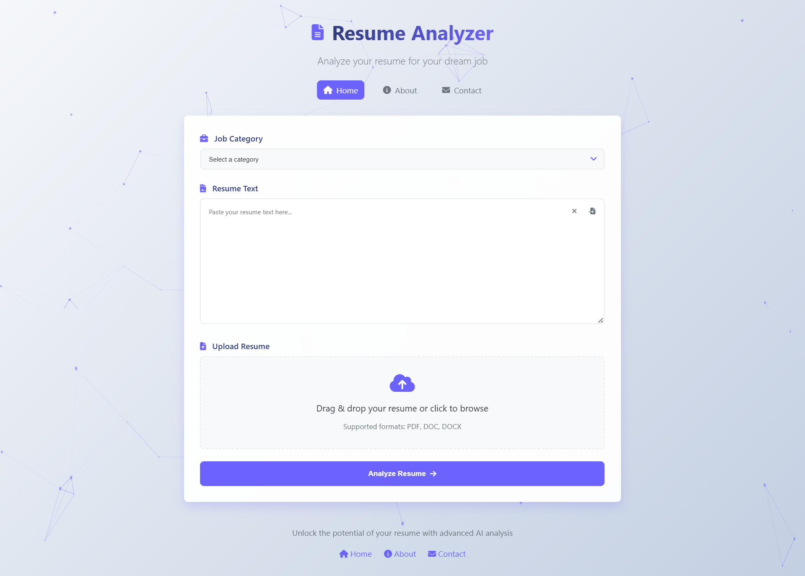
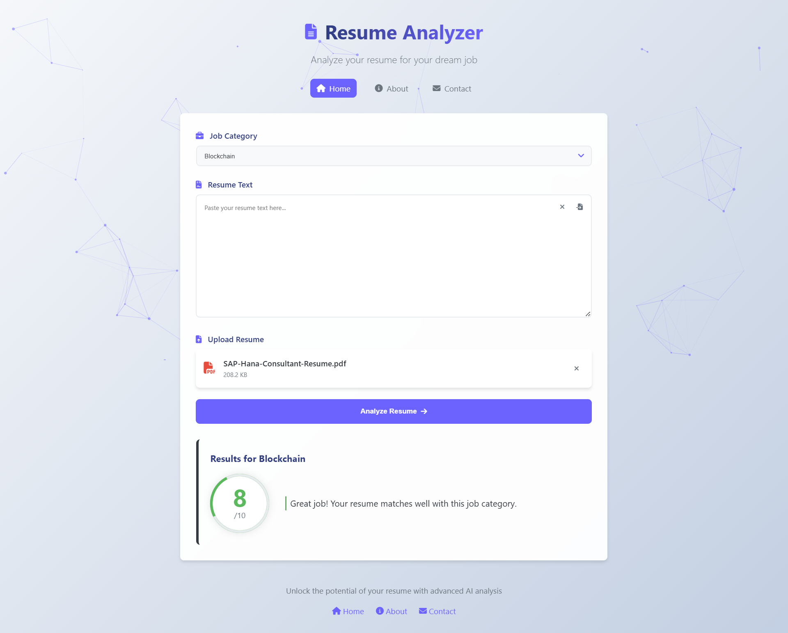
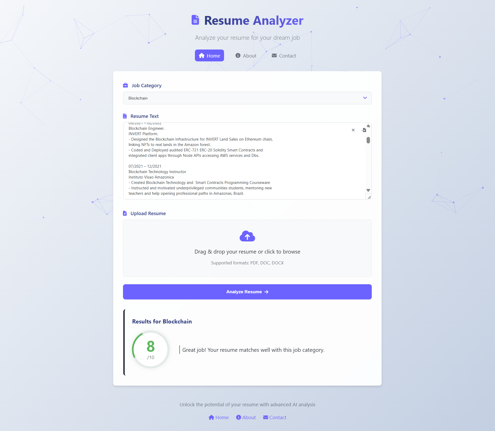
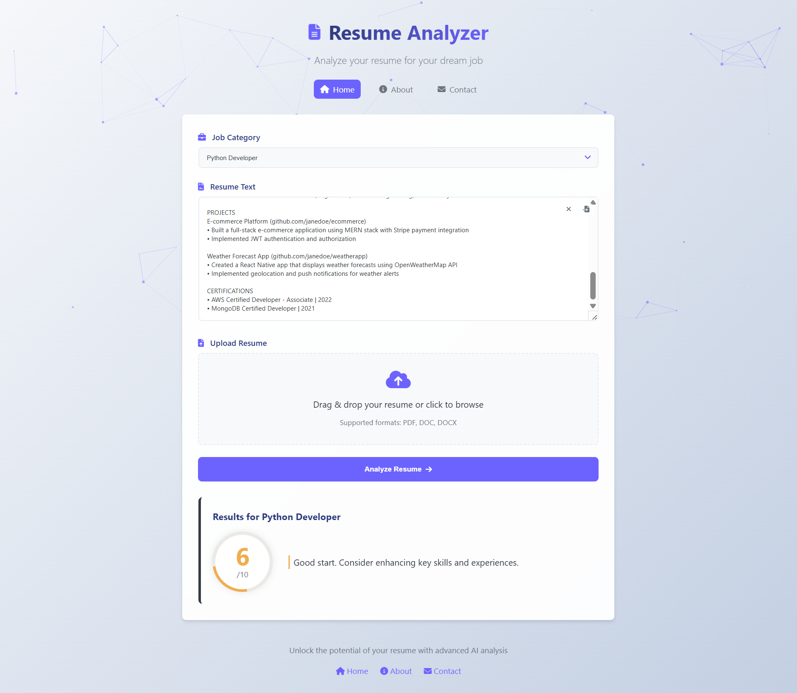

# AI Resume Analyzer


## 📌 Overview

The AI Resume Analyzer is an intelligent tool that helps both job seekers and recruiters by analyzing resumes against specific job categories. Using advanced NLP and deep learning techniques, it provides a score (0-10) indicating how well a resume matches a particular job category.

<p align="center">
  
</p>
<br/>
<p align="center">
  &emsp;
  
</p>

<p align="center">
  &emsp;
  
</p>

## ✨ Key Features

-   **AI-Powered Analysis**: Uses deep learning to evaluate resume content
-   **Job-Specific Scoring**: Scores resumes against 25+ professional categories
-   **Multi-Format Support**: Processes PDF, DOCX, DOC, and plain text
-   **Privacy Focused**: No resume data is stored after processing

## 🛠️ Technical Stack

-   **Backend**: Python, Flask
-   **NLP**: Sentence Transformers, PDFMiner
-   **Frontend**: HTML5, CSS3, JavaScript
-   **Machine Learning**: Scikit-learn, NLTK

## 📊 Dataset Source

The model was trained on [Resume Dataset](https://www.kaggle.com/datasets/gauravduttakiit/resume-dataset)

## 🚀 Getting Started

### Prerequisites

-   Python 3.8+
-   pip package manager
-   Git (optional)

### Installation

1. Clone the repository:

```bash
git clone https://github.com/YAHYA-YOUNAS/AI-Resume-Analyzer.git
cd AI-Resume-Analyzer
```

2. Create a virtual environment:

```bash
python -m venv venv
source venv/bin/activate  # On Windows use `venv\Scripts\activate`
```

3. Install dependencies:

```bash
pip install -r requirements.txt
```

4. Additional system dependencies (for PDF processing):

    **Linux**:

    ```bash
    sudo apt-get install poppler-utils
    ```

    **Mac**:

    ```bash
    brew install poppler
    ```

    **Windows**: Install Xpdf tools and add to PATH

### Running the Application

1. Start the Flask server:

```bash
python app.py
```

2. Access the application:
    - Open your browser and visit:
    - http://localhost:5000

## 🎯 How It Works

1. Select a Job Category from 25 available professional categories
2. Upload your resume (PDF/DOC/DOCX) or paste the text
3. Get instant analysis with a score (0-10)

### Score Interpretation

| Score Range | Rating    | Description                        |
| ----------- | --------- | ---------------------------------- |
| 9-10        | Excellent | Highly optimized for the position  |
| 7-8         | Good      | Strong match with job requirements |
| 5-6         | Fair      | Needs some improvements            |
| 3-4         | Weak      | Significant improvements needed    |
| 0-2         | Poor      | Major revisions required           |

## 📂 Project Structure

```
ai-resume-parser/
├── app.py                # Flask application
├── resume_parser.py      # Core analysis logic
├── models/               # Pre-trained models
├── static/               # CSS, JS, assets
├── templates/            # HTML templates
├── uploads/              # Temporary file storage
├── requirements.txt      # Python dependencies
└── README.md             # This file
```

## 🤝 Contributing

Contributions are welcome! Please follow these steps:

1. Fork the repository
2. Create your feature branch (`git checkout -b feature/AmazingFeature`)
3. Commit your changes (`git commit -m 'Add some AmazingFeature'`)
4. Push to the branch (`git push origin feature/AmazingFeature`)
5. Open a Pull Request

## 📜 License

This project is licensed under the MIT License.
